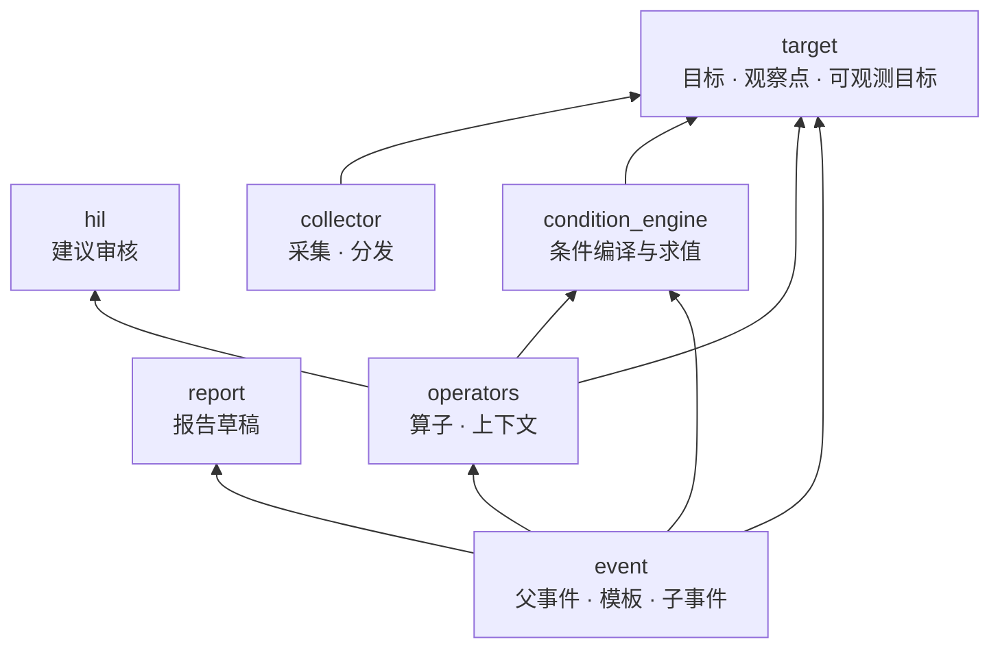
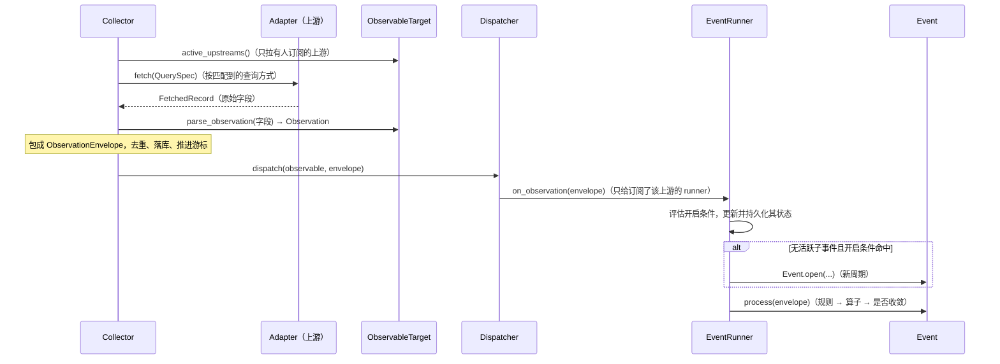
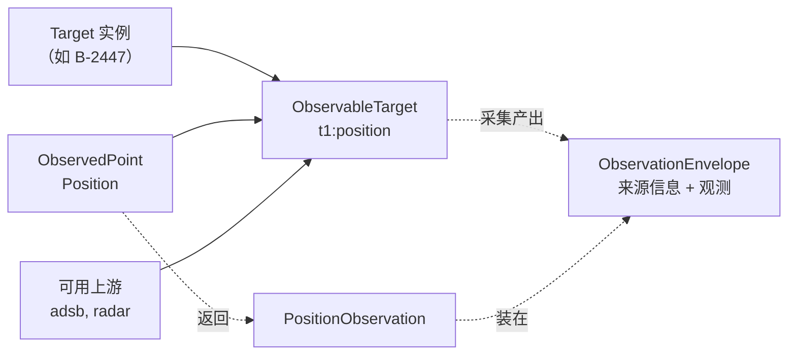
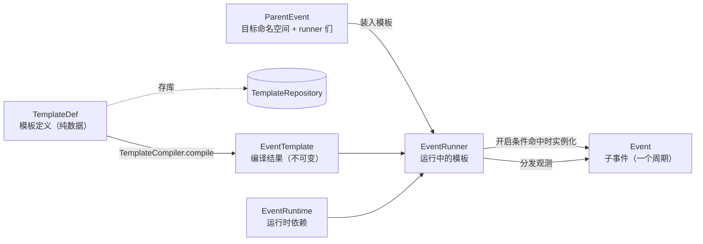
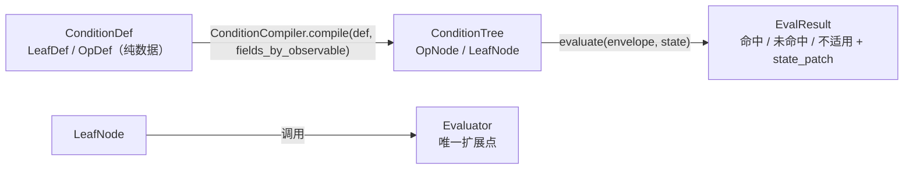

# Orion · 信息监控系统

设计文档：信息监控系统 · 核心骨架搭建指南

- 术语表：[docs/glossary.md](docs/glossary.md)
- 待决设计问题：[docs/open-questions.md](docs/open-questions.md)

## 目录

```
src/
  core/<module>/     # target, collector, event, condition_engine, operators, hil, report
  plugins/<module>/  # 具体的 Target 子类 / ObservedPoint 子类 / Adapter / Evaluator / Operator 实现
  api/               # Web API 层（暂缓）
  persistence/       # 仓库实现 · ORM（暂缓）
  bootstrap.py       # 唯一的跨切面装配点
```

## 开发

```bash
uv sync
uv run pytest         # 测试
uv run pyright        # 类型检查（core 六个模块 strict）
uv run lint-imports   # 模块依赖边界
```

## 架构

### 模块依赖

箭头表示「依赖」。依赖只能单向，由 import-linter 强制（规则见 `pyproject.toml`）。



- 最底层：target、hil、report，不依赖其他 core 模块。
- event 不直接依赖 collector（数据由 Dispatcher 推给 runner）和 hil（建议经注入的 SuggestionSink 流出）。
- 各模块之间的接口（如 `UpstreamCatalog`、`SuggestionSink`）定义在使用方，由提供方结构化实现，
  在 `bootstrap.py` 里装配。

### 数据从采集到判断



### target：目标、观察点、上游

| 类 | 是什么 | 由谁定义 |
|---|---|---|
| `Target` 子类（如 `Aircraft`） | 一类静态目标；实例是一个具体目标（如注册号 B-2447 的飞机）。声明可以在哪些观察点被观测（`observed_points`） | 开发者（`plugins/target/`） |
| `ObservedPoint` 子类（如 `Position`） | 观察点：名字 + 返回什么观测。与目标类型无关，可被多种目标共用 | 开发者（`plugins/observed_points/`） |
| `Observation` 子类（如 `PositionObservation`） | 观测：观察点返回的数据，字段即形状 | 开发者（和观察点放在一起） |
| `Adapter`（上游） | 数据提供方：服务哪个观察点、支持哪些查询方式（`query_field_sets`，目标满足其一即可） | 开发者（`plugins/collector/`） |
| `ObservableTarget`（obs） | 目标实例 + 观察点 + 可用上游，全局唯一；订阅者按上游订阅，它按上游路由数据 | `TargetManager` 按需创建 |
| `ObservationEnvelope` | 观测的外壳：来源信息（可观测目标、上游、发生时间、去重 ID）+ 观测实例 | collector 产出 |



可用上游 = 服务该观察点、且目标满足其某种查询方式（该组字段都有值）的 Adapter。
上游不认识目标类型：同一个上游可以对飞机按 `icao24`、对船按 `mmsi` 查询。

### event：父事件、模板、子事件



| 类 | 性质 | 职责 |
|---|---|---|
| `TemplateDef`（及 `ObservationDef`、`RuleDef`、`OperatorMountDef`） | 纯数据 | 模板定义：观测声明、开启条件、规则、算子挂载。和用户打交道的接口，也是持久化的接口 |
| `TemplateCompiler` | 无状态服务 | 把定义编译成 `EventTemplate`，一次做完所有校验（观测声明、条件、字段、算子挂载），错误一次报全 |
| `EventTemplate` | 运行时对象，不可变 | 编译结果：开启条件树、规则树、规范化后的算子挂载；持有原定义。不存库，每次从定义编译 |
| `EventRuntime` | 依赖包 | 仓库、`TargetManager`、编译器、算子注册表、建议去处、报告管理器；bootstrap 装配一次 |
| `ParentEvent` | 静态（带运行时部件） | 目标命名空间 + 一组 runner + `digest()`。唯一调用 `TemplateCompiler` 的地方：装入模板时先按定义检查命名空间和版本，再编译、保存定义，然后交给 runner；重启时读回定义编译后交给 runner 恢复。自己不订阅、不接收数据 |
| `EventRunner` | 有状态的活对象 | 持有模板和运行时依赖：按观测声明订阅；每条观测都评估开启条件并持久化其状态；无活跃子事件且命中时实例化 `Event`；把观测交给活跃 `Event`；新版本挂起到当前子事件关闭后再切换；`dispose` 时取消订阅 |
| `Event` | 有状态的活对象 | 一个周期（`cycle` = 开启时数据发生的年份）：跑规则和算子、维护业务状态和规则状态，收敛后关闭 |

同一模板同时最多一个活跃子事件；子事件是以年为周期重复发生的事情。

### condition_engine：条件



- 编译时由调用方（`TemplateCompiler`）传入「可观测目标 → 它的观测有哪些字段」，条件只能引用已声明的观测。
- 求值是纯函数：状态由调用方保管（runner 保管开启条件的状态，`Event` 保管规则的状态），
  用 `apply_state_patch` 合并结果里的 `state_patch`。

### 静态定义与运行时对象

整个 core 遵循同一个模式：**持久化只存纯数据定义，运行时对象每次从定义编译或重建**。

| 纯数据定义（存库） | 编译 / 重建者 | 运行时对象 |
|---|---|---|
| `TemplateDef` | `TemplateCompiler` | `EventTemplate` |
| `ConditionDef` | `ConditionCompiler` | `ConditionTree` |
| `TargetRecord` | `TargetManager` | `Target` 子类实例 |
| `ParentEventRecord` / `EventRecord` | `ParentEventManager` / `EventRunner` | `ParentEvent` / `EventRunner` / `Event` |

命名约定：纯数据定义的类型以 `Def` 结尾，装着它的字段以 `_def` / `_defs` 结尾；运行时对象不带后缀。
