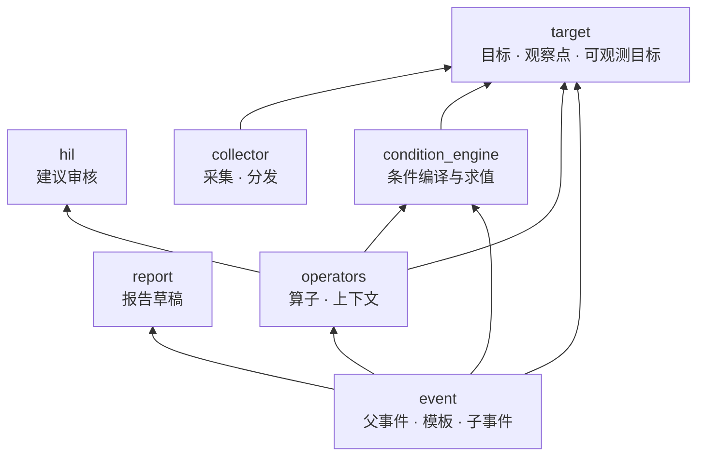
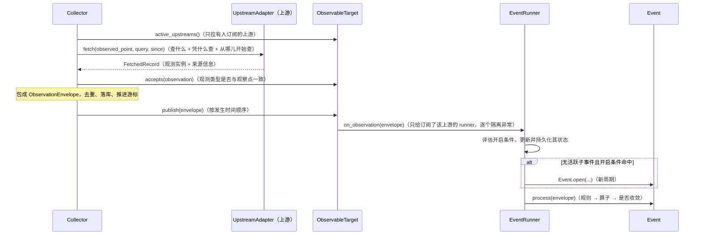
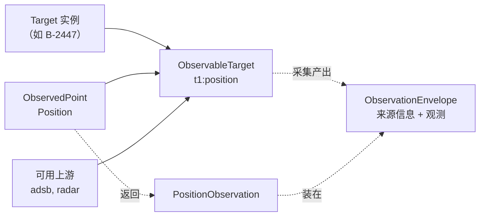
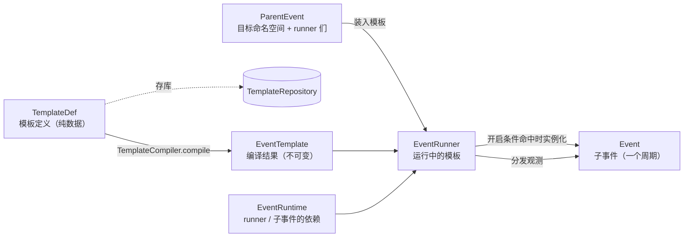
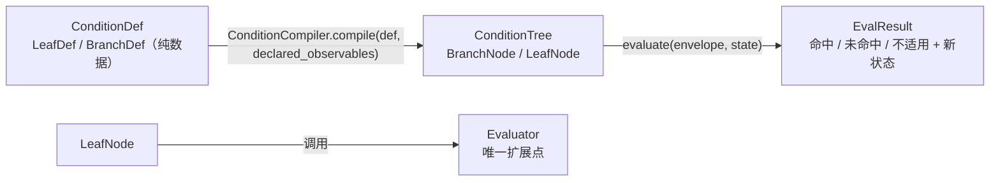

# Orion · 信息监控系统

设计文档：信息监控系统 · 核心骨架搭建指南

- 术语表：[docs/glossary.md](docs/glossary.md)
- 待决设计问题：[docs/open-questions.md](docs/open-questions.md)

## 目录

```
src/
  core/<module>/     # target, collector, event, condition_engine, operators, hil, report
  plugins/<module>/  # 具体的 Target 子类 / ObservedPoint 子类 / UpstreamAdapter / Evaluator / Operator 实现
  api/               # Web API 层（暂缓）
  persistence/       # 仓库实现 · ORM（暂缓）
  bootstrap.py       # 唯一的跨切面装配点
```

## 开发

```bash
uv sync
uv run pytest         # 测试
uv run pyright        # 类型检查（core 六个模块 strict）
uv run lint-imports   # 模块依赖边界
```

代码约定（docstring 风格、命名、插件写法）见 [CLAUDE.md](CLAUDE.md)。

## 架构

### 模块依赖

箭头表示「依赖」。依赖只能单向，由 import-linter 强制（规则见 `pyproject.toml`）。



- 最底层：target、hil、report，不依赖其他 core 模块。
- event 不直接依赖 collector（数据由可观测目标 publish 给订阅它的 runner）和 hil（建议经注入的 SuggestionSink 流出）。
- 各模块之间的接口（如 `UpstreamCatalog`、`SuggestionSink`）定义在使用方，由提供方结构化实现，
  在 `bootstrap.py` 里装配。

### 数据从采集到判断



### target：目标、观察点、查询键、上游

| 类 | 是什么 | 由谁定义 |
|---|---|---|
| `Target` 子类（如 `Aircraft`） | 一类静态目标；实例是一个具体目标（如注册号 B-2447 的飞机）。用 `@target_type("aircraft", observed_points=[Position])` 声明类型名和观察点，字段用 `provides(Registration)` 关联查询键 | 开发者（`plugins/target/`） |
| `ObservedPoint` 子类（如 `Position`） | 观察点：名字 + 返回什么观测。与目标类型无关，可被多种目标共用 | 开发者（`plugins/observed_points/`） |
| `Observation` 子类（如 `PositionObservation`） | 观测：观察点返回的数据，字段即形状 | 开发者（和观察点放在一起） |
| `QueryKey` 子类（如 `Icao24`） | 查询键：拿什么去查一个目标，名字 + 取值的类型与格式 | 开发者（`plugins/query_keys/`） |
| `UpstreamAdapter`（上游） | 接入一个数据提供方（上游，如 OpenSky）：服务哪些观察点（`observed_points`，可多个）、支持哪些查询方式（`query_key_sets`，每种是一组查询键，目标能提供其一即可），把查询键翻译成上游 API、把响应翻译成观测 | 开发者（`plugins/upstream_adapters/`） |
| `ObservableTarget`（obs） | 目标实例 + 观察点 + 可用上游，全局唯一；订阅者按上游订阅（`subscribe`），它把观测发布（`publish`）给订阅了该上游的订阅者 | `TargetManager` 按需创建 |
| `ObservationEnvelope` | 观测的外壳：来源信息（可观测目标、上游、发生时间、去重 ID）+ 观测实例 | collector 产出 |



可用上游 = 服务该观察点、且目标能提供其某种查询方式要的全部查询键（字段有值）的 UpstreamAdapter。
一个上游 = 一个数据提供方，可以服务多个观察点（`fetch` 按 `observed_point` 分支）；模板里写的上游名就是提供方的名字。
游标、订阅、路由都按（可观测目标, 上游）组织，可观测目标里已带观察点，所以同一上游的不同观察点互不干扰。
上游不认识目标类型：同一个上游可以对飞机按 `Icao24`、对船按 `Mmsi` 查询。

三种声明都用装饰器，插件作者不用写 `ClassVar` / `Annotated` / `Literal`：

```python
@observed_point("position", observation=PositionObservation)
class Position(ObservedPoint): ...

@query_key("icao24", pattern=r"^[0-9a-f]{6}$")
class Icao24(QueryKey): ...

@target_type("aircraft", observed_points=[Position])
class Aircraft(Target):
    registration: str = provides(Registration)            # 这个字段提供查询键 Registration
    icao24: str | None = provides(Icao24, default=None)   # 可为空
```

观察点和查询键是目标类型与上游之间的两份契约，双方都 import 同一个类，不靠字段名字符串对齐：

| 契约 | 方向 | 目标类型声明 | UpstreamAdapter 声明 |
|---|---|---|---|
| 观察点 `ObservedPoint` | 输出：上游返回什么 | `@target_type(..., observed_points=[Position])` | `@upstream_adapter(observed_points=[Position], ...)` |
| 查询键 `QueryKey` | 输入：上游拿什么去查 | `icao24: str \| None = provides(Icao24, default=None)` | `@upstream_adapter(..., query_key_sets=[{Icao24}])` |

输入这一侧的分工：

| 谁 | 做什么 | 不知道什么 |
|---|---|---|
| 查询键 | 定义输入的词汇：每个查询键是一项输入（名字 + 取值格式），全部查询键就是输入的全部范围 | 上游、目标类型 |
| 目标类型 | 把自己的字段映射进查询键（`provides(...)`）；字段为空的不算提供 | 上游 |
| UpstreamAdapter | 在查询键范围里挑自己要的：`query_key_sets` 是几种可选的查询方式，每种是一组**联立**的查询键（要全部提供）；按优先级取第一种满足的。再把查询键翻译成上游 API 的参数名和格式（如 `Icao24` → `ICAO`、大写） | 目标类型、目标的字段名 |

**不在查询键范围内的，UpstreamAdapter 拿不到。** `fetch(observed_point, query, since)` 的三个参数各管一件事：

| 参数 | 管什么 | 来源 |
|---|---|---|
| `observed_point` | 查什么：哪个观察点（类，分支时写 `observed_point is Position`） | 可观测目标 |
| `query` | 凭什么查：这次采用的查询方式及取值，如 `{Icao24: "780a3b"}`（构造目标时已按查询键校验） | `UpstreamAdapter.choose_query(目标能提供的查询键)` |
| `since` | 从哪儿开始查：这个上游的游标 | collector |

`query` 是 UpstreamAdapter 得到目标信息的唯一途径：UpstreamAdapter 看不到目标本身、目标类型和字段名。挑查询方式的
`choose_query` 是基类方法，只接收目标能提供的查询键；判断可用上游和实际采集都用它，两处结果一致。

#### target 的窗口与扩展点

target 装两类东西：**静态的定义与契约**（看什么、凭什么认出目标）和**运行时的枢纽**（谁在看——可观测目标的发布订阅）。
collector 与 event 互不认识，只在可观测目标这里会合。

对外的窗口（按使用方）：

| 使用方 | 窗口 | 用来做什么 |
|---|---|---|
| bootstrap | `TargetManager.register_type` | 启动时注册目标类型（顺带收集观察点、检查查询键关联） |
| API 层（待建） | `TargetManager.parse` / `upsert_target` / `get_target` / `find_by_alias` / `remove_target` | 目标的增删改查；`parse` 把 JSON 按 `type` 还原成对应的目标类型 |
| event · 父事件 | `TargetManager.get_target` | 确认目标存在、取展示名 |
| event · 模板编译器 | `TargetManager.inspect_observable` / `get_observable` | 先只检查（不创建），全部通过后取得 / 创建可观测目标 |
| event · runner | `ObservableTarget.subscribe` / `unsubscribe`；回调 `Subscriber.on_observation` | 按上游订阅；收观测 |
| collector | `TargetManager.active_observables`；`ObservableTarget.active_upstreams` / `accepts` / `publish`；`Target.query_values` | 找要采集的可观测目标和上游；检查观测类型；发布；取目标能提供的查询键 |

要别人提供的：`UpstreamCatalog`（collector 的 `UpstreamAdapterRegistry` 实现，bootstrap 注入）、`TargetRepository`、
`ObservableTargetRepository`（持久化层实现）。

扩展点有三个，都用装饰器声明（写法见上文）：

| 扩展点 | 放在 | 声明什么 |
|---|---|---|
| 目标类型 `@target_type` | `plugins/target/` | 类型名、属性字段、能在哪些观察点被观测；字段用 `provides(查询键)` 关联查询键 |
| 观察点 `@observed_point` | `plugins/observed_points/` | 名字 + 返回什么观测（`Observation` 子类，字段即形状） |
| 查询键 `@query_key` | `plugins/query_keys/` | 名字 + 取值格式（`pattern` 或 `value_type`） |

### collector：采集

对外的窗口（按使用方）：

| 窗口 | 谁用 | 何时 |
|---|---|---|
| `Collector.collect()` | 调度器 | 运行时，定时：对全部活跃可观测目标采集一轮 |
| `Collector.collect_one(observable)` | 调度器 / 以后的「手动刷新」 | 运行时，按需：立即采集一个可观测目标 |
| `UpstreamAdapterRegistry.upstreams_for()`（即 target 的 `UpstreamCatalog`） | `TargetManager` | 运行时，创建可观测目标时问「哪些上游能观测它」。target 只认协议，bootstrap 注入 |
| `UpstreamAdapterRegistry.register()` | bootstrap | 启动时注册全部上游适配器 |

要别人提供的（collector 定义接口，持久化层实现）：`CursorRepository`（每个（可观测目标, 上游）一个游标）、
`ObservationRepository`（已采集观测，只增不改）。

扩展点只有一个：继承 `UpstreamAdapter` 并用 `@upstream_adapter` 声明，放在 `plugins/upstream_adapters/`——
声明需要什么输入（`query_key_sets`）、能提供什么输出（`observed_points`），实现怎么查（`fetch`）：

```python
@upstream_adapter(observed_points=[Position], query_key_sets=[{Icao24}])
class OpenSkyAdapter(UpstreamAdapter):          # 上游名默认 "openSky"（去掉 Adapter 后缀、首字母小写）
    def fetch(self, observed_point, query, since): ...
```

见上节「输入这一侧的分工」和 `plugins/upstream_adapters/opensky.py`。

内部分工：`Collector.collect` → `collect_one`（一个可观测目标的全部活跃上游，拉完按时间顺序 `publish`）→
`_collect_upstream`（一个上游：挑查询 → `fetch` → 检查观测类型、去重 → 落库、推进游标）。

### event：父事件、模板、子事件



| 类 | 性质 | 职责 |
|---|---|---|
| `TemplateDef`（及 `ObservableDef`、`RuleDef`、`OperatorMountDef`） | 纯数据 | 模板定义：可观测目标声明、开启条件、规则、算子挂载。和用户打交道的接口，也是持久化的接口 |
| `TemplateCompiler` | 无状态服务 | 把定义编译成 `EventTemplate`，一次做完所有校验（可观测目标声明、条件、字段、算子挂载），错误一次报全 |
| `EventTemplate` | 运行时对象，不可变 | 编译结果：runner 要订阅的 `compiled_observables`（`CompiledObservable`：可观测目标 + 要订阅的上游）、开启条件树、规则树、规范化后的算子挂载；持有原定义。不存库，每次从定义编译 |
| `ParentEventManager` | 入口 | 创建、查找、重启恢复父事件；持有父事件仓库，父事件变更后经 `on_change` 回调这里存档 |
| `ParentEventServices` | 依赖包 | 只有父事件用到的：`TargetManager`、模板仓库、模板编译器、报告管理器；由 `ParentEventManager` 交给父事件 |
| `EventRuntime` | 依赖包 | runner 和子事件共用的：子事件仓库、开启条件状态仓库、算子注册表、建议去处；父事件转交给 runner |
| `ParentEvent` | 静态（带运行时部件） | 目标命名空间 + 一组 runner + `digest()`。唯一调用 `TemplateCompiler` 的地方：装入模板时先按定义检查命名空间和版本，再编译、保存定义，然后交给 runner；重启时读回定义编译后交给 runner 恢复。自己不订阅、不接收数据，也不持久化自己（变更后调用 `on_change`） |
| `EventRunner` | 有状态的活对象 | 持有模板和运行时依赖：按模板里解析好的可观测目标订阅（不接触 `TargetManager`）；每条观测都评估开启条件并持久化其状态；无活跃子事件且命中时实例化 `Event`；把观测交给活跃 `Event`；新版本挂起到当前子事件关闭后再切换；`dispose` 时取消订阅 |
| `Event` | 有状态的活对象 | 一个周期（`cycle` = 开启时数据发生的年份）：跑规则和算子、维护业务状态和规则状态，收敛后关闭 |

同一模板同时最多一个活跃子事件；子事件是以年为周期重复发生的事情。

#### 可观测目标：声明 → 编译 → 订阅

| 阶段 | 形态 | 放在哪 | 可变性 |
|---|---|---|---|
| 声明 | `ObservableDef`（目标 ID + 观察点名 + 上游） | `TemplateDef.observable_defs`，存库 | 纯数据，不可变 |
| 编译 | `CompiledObservable`（可观测目标实例 + 要订阅的上游） | `EventTemplate.compiled_observables` | 随模板版本，不可变 |
| 订阅 | `ObservableTarget`（按 ID 索引） | `EventRunner._subscribed_observables` | runner 当前的订阅，会变 |

- 三个阶段指向同一个对象：编译时由 `TargetManager` 取得（必要时创建）唯一的 `ObservableTarget`，
  订阅只是 runner 把自己登记为它的订阅者，不产生新对象。
- 编译了不等于订阅了：挂起的新版本已有自己的 `compiled_observables`，要等当前周期结束、切换版本时
  才经 `_sync_subscriptions` 变成已订阅。所以编译结果放在模板里（跟版本走），订阅状态放在 runner 里（只表示“现在订阅着什么”）。
- 反向由 runner 负责：切换版本时退订新版本不再需要的，`dispose` 时全部退订；可观测目标本身保留到目标被删除。

#### 模板定义示例

装入模板时提交的就是一个 `TemplateDef`（`ParentEvent.upsert_template`）。下面的例子：观测两架飞机的位置，
任意一架进入区域就开启子事件；子事件期间每次进入区域都计数，累计 3 次收敛关闭；关闭时写一份报告草稿。

<!-- template-example:start -->
```json
{
  "id": "east-sea-entry",
  "version": 1,
  "name": "东海方向进入",
  "observable_defs": [
    {"target_id": "t1", "observed_point": "position", "upstreams": ["adsb"]},
    {"target_id": "t2", "observed_point": "position", "upstreams": ["adsb", "radar"]}
  ],
  "open_condition_def": {
    "kind": "branch",
    "op": "any",
    "children": [
      {"kind": "leaf", "observable": "t1:position", "op": "onEnter",
       "criteria": {"area": [[0, 0], [0, 10], [10, 10], [10, 0]]}},
      {"kind": "leaf", "observable": "t2:position", "op": "onEnter",
       "criteria": {"area": [[0, 0], [0, 10], [10, 10], [10, 0]]}}
    ]
  },
  "rule_defs": [
    {
      "name": "enter",
      "condition_def": {
        "kind": "branch",
        "op": "any",
        "children": [
          {"kind": "leaf", "observable": "t1:position", "op": "onEnter",
           "criteria": {"area": [[0, 0], [0, 10], [10, 10], [10, 0]], "initial_as_enter": true}},
          {"kind": "leaf", "observable": "t2:position", "op": "onEnter",
           "criteria": {"area": [[0, 0], [0, 10], [10, 10], [10, 0]], "initial_as_enter": true}}
        ]
      },
      "hook_defs": [
        {"operator": "count_hits", "mount_point": "rule_hit", "params": {"threshold": 3}}
      ]
    }
  ],
  "hook_defs": [
    {"operator": "close_report", "mount_point": "closed", "params": {"title": "东海方向进入"}}
  ]
}
```
<!-- template-example:end -->

| 字段 | 含义 |
|---|---|
| `id` / `version` / `name` | 模板 ID、版本号（改模板 = 提交更大的版本，下个周期生效）、展示名 |
| `observable_defs` | 可观测目标声明：订阅哪些 (目标, 观察点)，以及从哪些上游取数。目标必须在父事件的命名空间里；可观测目标 ID 形如 `t1:position` |
| `open_condition_def` | 开启条件（必填）：无活跃子事件时命中才开启新周期 |
| `rule_defs` | 规则：子事件运行期间每条观测都评估；`name` 在模板内唯一；`hook_defs` 只能挂 `rule_hit` |
| `hook_defs` | 子事件级算子：挂在 `created` / `closed` / `pre` / `status_updated` / `post` |
| 条件分支（`kind: branch`） | `op` 为 `all` / `any` / `not`，`children` 是子条件，可任意嵌套 |
| 条件叶子（`kind: leaf`） | `op` 是判断方式（如 `onEnter`）；`observable` 引用 `observable_defs` 里声明的可观测目标；`criteria` 是判定标准，由该判断方式解释 |

两种节点形状一致：`kind` 说明是哪种节点，`op` 说明做什么运算，其余是操作对象（叶子是 `observable` + `criteria`，分支是 `children`）。

规则和可观测目标不是一一对应：每棵条件树在叶子里通过 `observable` 引用可观测目标，一条规则可以引用多个，
同一个可观测目标也可以被多条规则引用。观测到来时交给所有条件树评估，叶子遇到不属于自己的观测返回「不适用」。
注意：用 `all` 组合不同可观测目标的叶子时，各叶子独立判断，暂时表达不了「两者同时满足」（见待决问题第 4 条）。

### condition_engine：条件



- 编译时由调用方（`TemplateCompiler`）传入「可观测目标 → 它产出的观测类」，字段由观测类自己描述。
  编译要补上的是定义期间的缺口：叶子引用的可观测目标必须已声明，它的观测必须有判断方式要求的全部字段——
  否则要到运行时才暴露（每条数据都「不适用」，条件永远不命中，也不报错）。
  传观测类而不是可观测目标本身，是因为编译时可观测目标可能还没创建（被拒的模板不留下可观测目标）。
  引用范围在编译时就查完了，编译出的树不再对外暴露它引用了哪些可观测目标。
- 求值是纯函数：状态由调用方保管（runner 保管开启条件的状态，`Event` 保管规则的状态），
  结果的 `state` 就是新状态（`None` 表示没变），调用方直接换上并在变了时持久化。
  状态放在树外是必要的：同一棵树被一个模板版本历年的所有子事件共用，每个子事件的规则状态各不相同。

#### condition_engine 的窗口与扩展点

条件引擎只做两件事：编译（定义 → 条件树）、求值（一条观测 → 三值结果）。不存状态、不订阅、不查询 target。

对外的窗口（按使用方）：

| 使用方 | 窗口 | 时机 |
|---|---|---|
| event · 模板编译器 | `ConditionCompiler.compile(condition_def, declared_observables)` | 编译时：定义 → 条件树；错误收集后一次抛出，每条带节点路径（如 `root/1/0`） |
| event · runner / 子事件 | `ConditionTree.evaluate(envelope, state)` | 运行时：纯函数求值；结果的 `state` 是整棵树的新状态（`None` = 没变），调用方保管 |
| bootstrap | `EvaluatorRegistry.register` | 启动时注册判断方式 |
| 跨模块传递的纯数据 | `ConditionDef`（`LeafDef` / `BranchDef`）、`EvalResult`（`HIT` / `MISS` / `NOT_APPLICABLE`） | — |

依赖：target（只用 `ObservationEnvelope`，见 open-questions 第 5 条）。

扩展点只有一个：继承 `Evaluator` 并用 `@evaluator` 声明，放在 `plugins/condition_engine/`——一种判断方式：

```python
@evaluator(requires={"lat", "lon"})
class OnEnter(Evaluator[OnEnterCriteria]):
    def evaluate(self, envelope, state, criteria): ...
```

| 声明 / 实现 | 含义 |
|---|---|
| `op` | 模板里叶子的 `op` 引用它。默认类名首字母小写（`OnEnter` → `"onEnter"`），缩写开头的类名用 `op=` 指定 |
| `requires` | 需要观测里有值的字段名；缺失或为空时叶子直接返回「不适用」，不调用判断方式 |
| 判定标准模型 | 取泛型参数（`Evaluator[OnEnterCriteria]`），编译时用它校验叶子的 `criteria`；也可 `criteria=` 指定 |
| `evaluate(envelope, state, criteria)` | 判断；不改传入的 `state`（只读），把本叶子的**完整**新状态放进结果的 `state`（不是变化量；没变就不填）；返回「不适用」时不得带 `state` |

示例见 `plugins/condition_engine/on_enter.py`（进入区域，有状态）。

### 静态定义与运行时对象

整个 core 遵循同一个模式：**持久化只存纯数据定义，运行时对象每次从定义编译或重建**。

| 纯数据定义（存库） | 编译 / 重建者 | 运行时对象 |
|---|---|---|
| `TemplateDef` | `TemplateCompiler` | `EventTemplate` |
| `ConditionDef` | `ConditionCompiler` | `ConditionTree` |
| `TargetRecord` | `TargetManager` | `Target` 子类实例 |
| `ParentEventRecord` / `EventRecord` | `ParentEventManager` / `EventRunner` | `ParentEvent` / `EventRunner` / `Event` |

谁管理一组对象，谁负责持久化它们：`ParentEventManager` 存父事件记录，`EventRunner` 存子事件记录；
被管理的对象只在变更后通知（`on_change`），自己不碰仓库。

命名约定：纯数据定义的类型以 `Def` 结尾，装着它的字段以 `_def` / `_defs` 结尾；运行时对象不带后缀。
